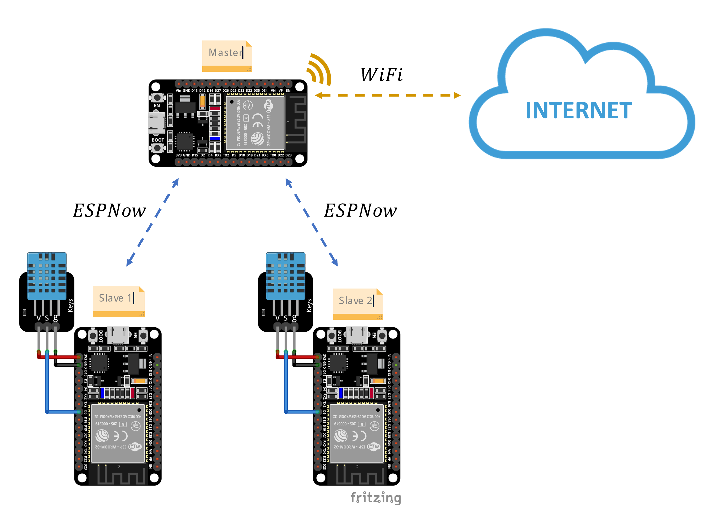

# ESP32 ESPNow with WiFi

This project shows how to establish a bidirectional communication between two ESP32 boards via ESPNow protocol. The communication is done over WiFi in the 2.4GHz band. The ESPNow protocol is a fast and secure way to send data between ESP32's without the need of WiFi credentials (acting as a WiFi AP). The Slaves have a DHT sensor attached and send the temperature and humidity to the Master. The Master sends the data to a HTTP server.

## Hardware Required
- 3 x ESP32 boards (I used the ESP32 DEVKITV1 DOIT board)
- 2 x DHT11

## Setup
- Upload the Arduino code called utilGetMacAddress to the ESP32 Master board. This code will print the MAC address of the board to the serial monitor. Copy the MAC address and paste it in the Arduino code called `espNowWifiSlave.ino` on the `broadcastAddress` variable.

- Upload the espNowWifiMaster to the ESP32 Master board. Make sure to edit the WiFi credentials.

- Upload the espNowWifiSlave to the ESP32 Slave boards. Make sure to edit the `int ident = 1;` for the Slave 1 and `int ident = 2;` for the Slave 2.